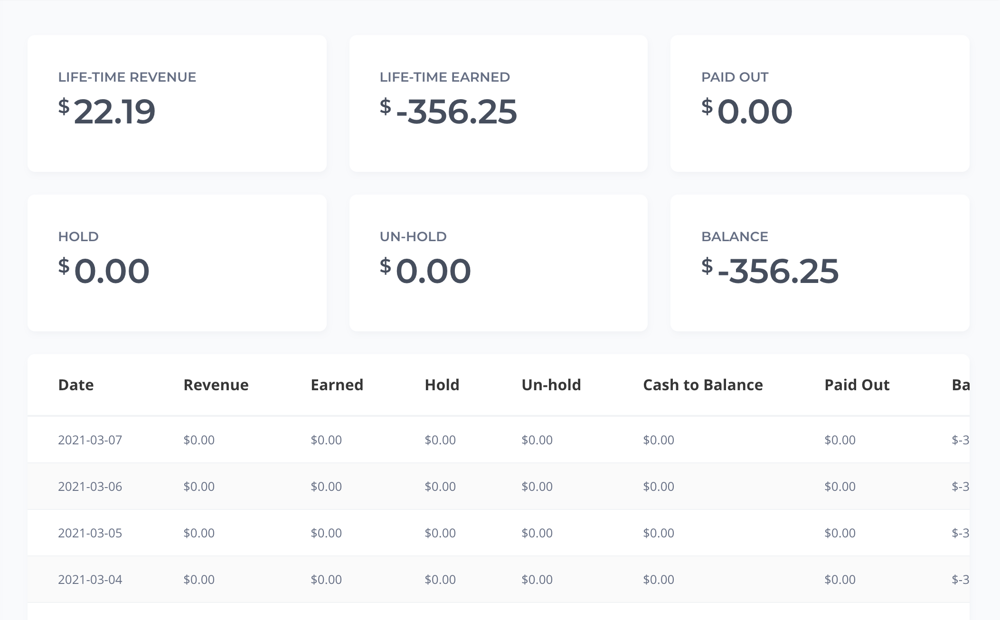

# Payment

## Bài toán.

Mô phỏng hệ thống tài chính của một nền tảng bán hàng trực tuyến.

- Hệ thống gồm 3 đối tượng: Người bán hàng (A), người mua hàng (B), nhân viên tài chính (C).
- Mỗi lần B giao dịch mua hàng, sẽ tạo một đơn hàng có giá trị là X$. Hệ thống sẽ tính cho A doanh thu là X$, và trừ đi a% tiền phí hệ thống và b% phí thanh toán, c% chi phí sản phẩm.
- Với mỗi đơn hàng, vì để đảm bảo rủi ro mà hệ thống sẽ hold đi x% giá trị đơn hàng. Phần hold này sẽ không được rút về sau n ngày.
- Mỗi một ngày A được phép rút tiền tối đa là 200$. Để được rút tiền thì C phải chấp nhận. Số tiền được rút là số tiền đã trừ phí, hold.
- A cũng có thể lựa chọn yêu cầu rút tiền tự động, hệ thống sẽ tự tạo giao dịch yêu cầu rút tiền vào thời điểm t tuỳ vào A yêu cầu.
- B cũng có thể yêu cầu hoàn tiền của đơn hàng. A có thể hoàn tiền toàn bộ cho B hoặc hoàn tiền một phần, só tiền được hoàn dựa trên số dư và số tiền đang được hold

## Yêu cầu
- Thiết kế database cho bài toán trên.
- Đưa ra được những sai lầm gặp phải khi giải quyết bài toán trên.
- Đưa ra giải pháp bằng cách mô tả để giải quyết bài toán trên, bao gồm cách xử lý bằng ngôn ngữ mình đang làm việc, vẽ mô tả kiến trúc.
- Trình bày giải pháp để đưa ra được báo cáo như hình vẽ. Trong đó LIFE-TIME REVENUE là doanh thu A nhận được từ trước tới giờ. LIFE-TIME EARNED: là tiền mà A có thể nhận được. PAID OUT: là tiền mà A đã rút. HOLD: là tiền bị hệ thống giữ. UN-HOLD: là tiền mà hệ thống đã bỏ hold. BALANCE: Là số dư hiện tại mà A có thể rút; Phần bảng báo cáo tính cutoff theo ngày.
- Điểm cộng nếu có thể triển khai được giải pháp. Khuyến khích trao đổi theo nhóm.
- Kết quả đưa lên 1 repo Gitlab
- Có thể tự do Google, Stackoverflow, ... nhưng đừng nhờ người khác làm hộ, chúng tôi muốn xem cách bạn code và xử lý vấn đề, nó quan trọng hơn!
- Thời gian tối đa là 7 ngày.

